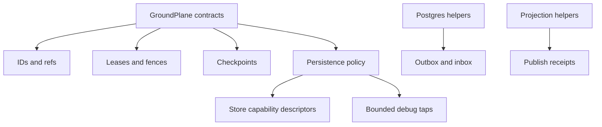
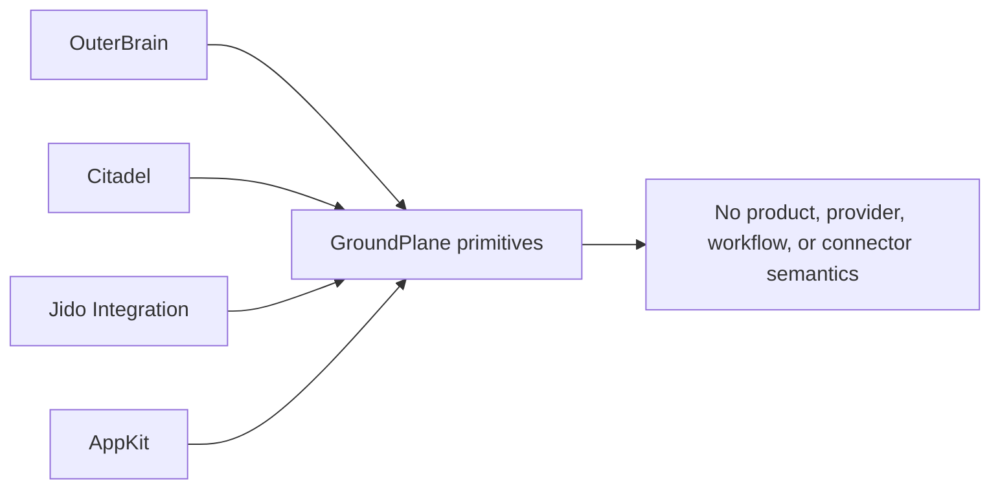

<p align="center">
  
</p>

<p align="center">
  <a href="https://github.com/nshkrdotcom/ground_plane">
    
  </a>
  <a href="https://github.com/nshkrdotcom/ground_plane/blob/main/LICENSE">
    
  </a>
</p>

# GroundPlane

GroundPlane is the shared lower infrastructure workspace for the nshkr platform
core.

It holds the reusable lower primitives that sit underneath `outer_brain`,
Citadel, `jido_integration`, and `app_kit`.

GroundPlane should stay boring, small, and generic. If a concept mentions a
product, provider, workflow engine, connector, model, runtime lane, or policy
decision, it probably belongs higher in the stack. GroundPlane is the place for
values that every owner can reuse without inheriting someone else's semantics.

## Stack Position

```text
all ranked repos
  -> ground_plane primitive packages
      -> ids, refs, leases, fences, checkpoints, persistence policy,
         generic Postgres helpers, generic projection helpers
```

Higher repos use these contracts to describe durable handoff and restart
boundaries. GroundPlane does not know what a Codex run, Linear issue, policy
pack, operator review, or semantic turn means.

## Scope

- shared contracts and state vocabulary
- Postgres transaction, outbox, inbox, and checkpoint helpers
- generic projection publication helpers
- generic persistence profile and debug-capture posture
- adaptive AI run fences when they remain ref-only lower primitives

## Internal Libraries

- `ground_plane_contracts`
- `ground_plane_ai_run_fencing`
- `ground_plane_persistence_policy`
- `ground_plane_persistence_policy_ai_extension`
- `ground_plane_postgres`
- `ground_plane_projection`

`ground_plane_persistence_policy` owns the pure profile contract for
persistence tier selection, debug capture level selection, store capability
descriptors, partition dimensions, and bounded debug taps. Its built-in default
profile is `:mickey_mouse`: memory-only, no restart durability claim, no
Postgres, no Temporal, no object storage, no external network dependency, no
live provider credential dependency, and no debug sidecar dependency.

## Status

Workspace root established. The internal packages are intentionally small and
generic.

## Current Delivery State

Active packages:

- `core/ground_plane_contracts`: lower shared IDs, refs, leases, fences,
  checkpoints, and state vocabulary.
- `core/ai_run_fencing`: ref-only adaptive AI run fences for endpoint leases,
  provider-pool leases, replay epochs, promotion epochs, router artifact
  epochs, and revoked candidate artifacts.
- `core/persistence_policy`: pure profile contracts for storage tier, debug
  capture level, store capabilities, partition dimensions, and bounded debug
  taps.
- `core/persistence_policy_ai_extension`: AI-specific persistence-profile
  extension points that still avoid product/provider semantics.
- `core/ground_plane_postgres`: generic Postgres transaction and outbox/inbox
  helpers.
- `core/ground_plane_projection`: generic projection publication helpers.
- `examples/projection_smoke`: composition proof for the packages.

Recent work added adaptive AI run fencing, persistence-policy packages,
persistence posture docs, credential lease fabric primitives, revoked-lease
restart fencing, and dependency-source/Weld gates.

## Primitive Admission Rule

Before adding a new primitive, check that it can be named and tested without
depending on product language or mechanism-specific behavior. Good examples are
lease expiry, fence epoch, checkpoint ref, projection publish receipt, and
storage capability descriptor. Bad examples are "Linear issue state", "Codex
turn policy", "operator review status", or "Temporal workflow retry"; those
belong in source/runtime/product owners that understand their meaning.

## Primitive Diagrams





## Development

The project targets Elixir `~> 1.19` and Erlang/OTP `28`.

```bash
mix ci
```

The welded `ground_plane_contracts` artifact is tracked through the prepared
bundle flow:

```bash
mix release.prepare
mix release.track
mix release.archive
```

`mix release.track` updates the orphan-backed
`projection/ground_plane_contracts` branch so downstream repos can pin a real
generated-source ref before any formal release boundary exists.

## Documentation

Workspace docs cover the overview, layout, contracts, Postgres helpers, and
projection helpers.

## License

MIT. Copyright (c) 2026 nshkrdotcom.

## Temporal developer environment

Temporal runtime development is managed from `/home/home/p/g/n/mezzanine`
through the repo-owned `just` workflow. Do not start ad hoc Temporal processes
or rely on the `temporal` CLI as the implementation runbook.

## Native Temporal development substrate

Temporal runtime development is managed from `/home/home/p/g/n/mezzanine` through the repo-owned `just` workflow, not by manually starting ad hoc Temporal processes.

Use:

```bash
cd /home/home/p/g/n/mezzanine
just dev-up
just dev-status
just dev-logs
just temporal-ui
```

Expected local contract: `127.0.0.1:7233`, UI `http://127.0.0.1:8233`, namespace `default`, native service `mezzanine-temporal-dev.service`, persistent state `~/.local/share/temporal/dev-server.db`.

## Persistence Documentation

See `docs/persistence.md` for tiers, defaults, adapters, unsupported selections, config examples, restart claims, durability claims, debug sidecar behavior, redaction guarantees, migration or preflight behavior, and no-bypass scope when applicable.
